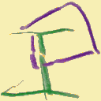
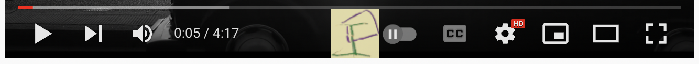
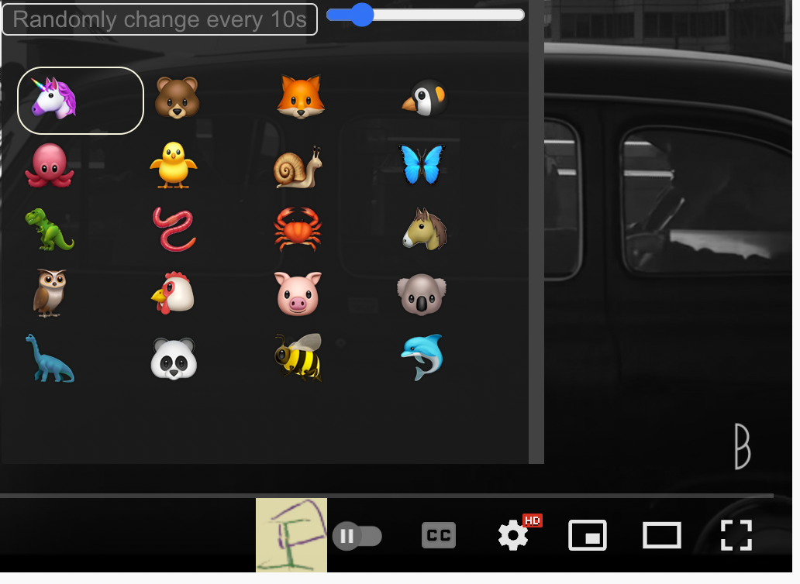
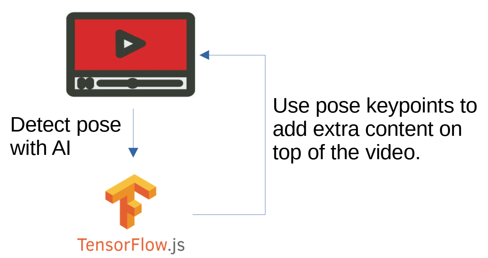
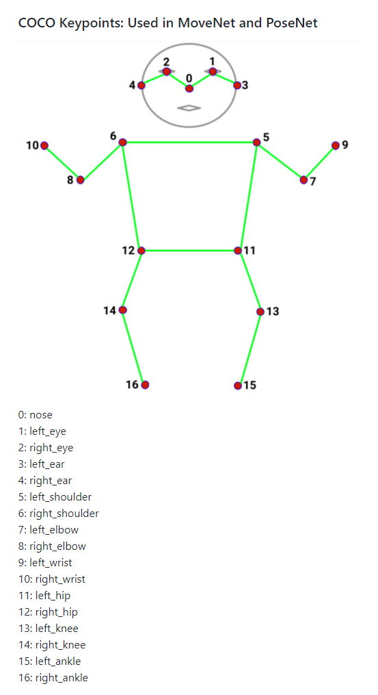
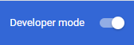
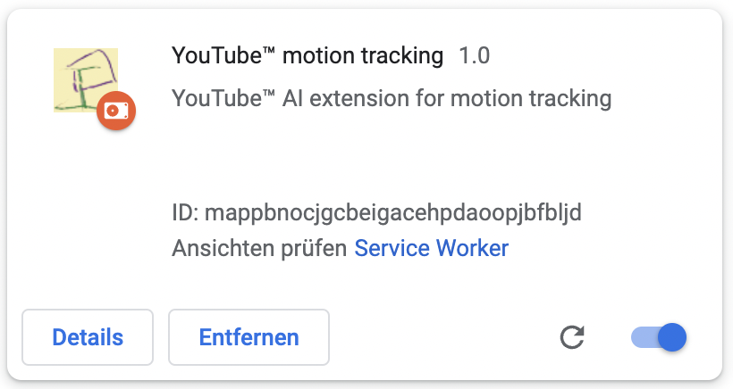
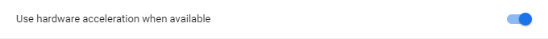

# YouTube™ motion tracking
  
Some examples from this [Video source](https://www.youtube.com/watch?v=eRjUmsB9lMk)    

  
_The logo was designed by a 3 year old girl._

YouTube™ motion tracking is a Chrome AI extension to visualize videos.

Pose estimation is done with [TensorFlow.js](https://www.tensorflow.org/js)  
Particle animation is done with [Proton](https://github.com/drawcall/Proton)

This project is a [Google Chrome](https://www.google.com/intl/en/chrome/) browser extension. That's why you need this browser to try it out.

# Features
A new button is available in the player.  
  

The new button opens the animation selection menu.  


# How it works.
The Chrome extension becomes active, when you watch a YouTube video.  



The extension use MoveNet as model.  
Visual representation of the keypoints:  
  
[Image from tensorflow.js pose-detection model](https://github.com/tensorflow/tfjs-models/tree/master/pose-detection#coco-keypoints-used-in-movenet-and-posenet)  
We use these keypoints to place animations on top of the YouTube™ video.

# Installation
<a name="clone"></a>
## Download this repository
```shell
git clone https://github.com/deep2universe/YouTubeMotionTracking.git
```

<a name="Build"></a>
## Development
I use [PARCEL](https://parceljs.org/) as build tool and install it globally with
```shell
# install PARCEL
npm install -g parcel
```

Build local
```shell
# install dependencies
npm install

# build dist folder
npm run build:parcel
```

<a name="chromeExtension"></a>
## Open Chrome extensions
Open this URL
```
chrome://extensions
```
<a name="enableDevMode"></a>
## Enable developer mode
In the upper right corner you have to activate the developer mode.  

<a name="loadExtension"></a>
## Load extension
Click this button to load the extension.  
Then select the build ```dist``` Folder from this repository.

<a name="checkExtension"></a>
## Check extension installation
You should now see the following entry.  


<a name="checkChromeSettings"></a>
## Check Chrome settings
Go to this [URL](chrome://settings/accessibility)
```
chrome://settings/accessibility
```
In the System settings make sure to enable this:    


<a name="Usage"></a>
# Usage
Open [YouTube](https://www.youtube.com/)

Watch a video and have fun.

<a name="uninstall"></a>
# Uninstall
Just go to the `chrome://extensions` page and disable or delete the extension.

## License

[Apache License 2.0](LICENSE)

YouTube™ is a trademark of Google Inc.  
Use of this trademark is subject to Google Permissions.  
