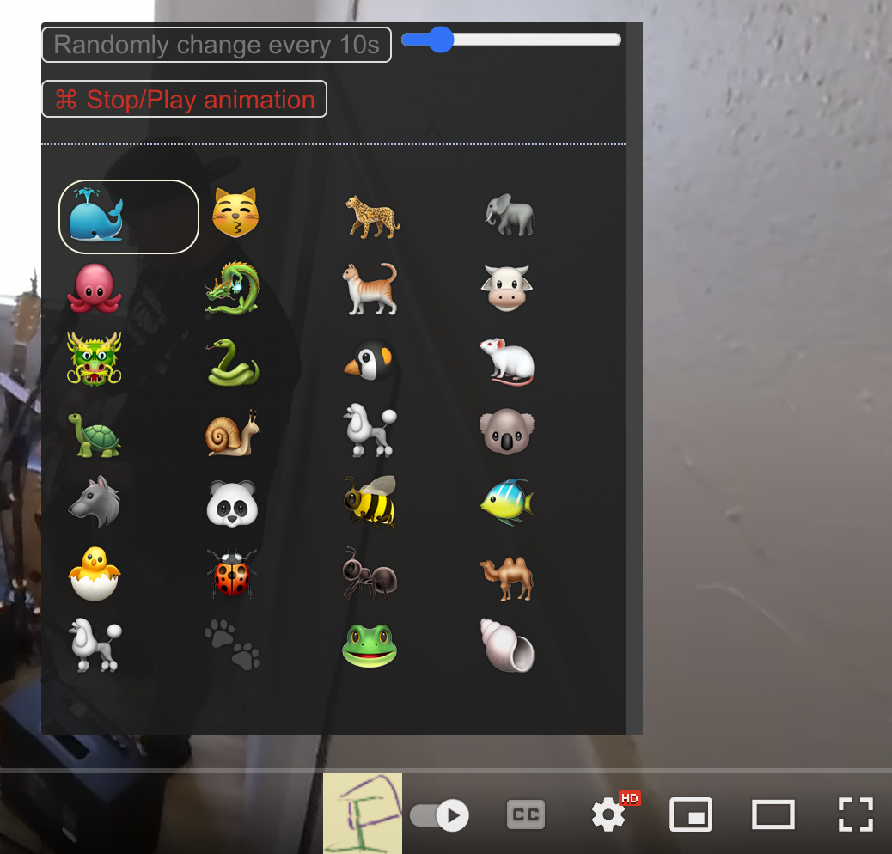

# YouTube Motion Tracking - Halloween Edition 🎃👻

Some examples from this [Video source](https://www.youtube.com/watch?v=eRjUmsB9lMk)


**YouTube Motion Tracking - Halloween Edition** is a Chrome AI extension that brings spooky Halloween animations to YouTube videos using real-time pose detection!

## 🎃 Halloween Features

This special Halloween edition features **18 spooky animations** across multiple categories:

### 💀 Skeleton Animations (5)
- **Glowing Skeleton** - Pulsating orange/green bones
- **Dancing Skeleton** - Shaking, rattling bones
- **X-Ray Vision** - Medical-style phosphorescent skeleton
- **Zombie Skeleton** - Decaying purple/green bones with dripping effects
- **Neon Skeleton** - Bright electric purple/orange glow

### 🎃 Pumpkin & Head Effects (3)
- **Classic Pumpkin Head** - Traditional jack-o'-lantern with glowing eyes
- **Evil Pumpkin Head** - Sinister grinning pumpkin with red eyes
- **Skull Head** - Floating skull with animated jaw

### 🦇 Creature Particle Effects (4)
- **Bat Swarm** - Bats flying from your hands
- **Ghost Trail** - Translucent ghosts following your movements
- **Spider Web** - Spiders crawling with web trails
- **Floating Skulls** - Orbiting bone-white skulls

### 🔮 Magical Effects (3)
- **Witch Magic** - Purple/green magic spirals
- **Spell Casting** - Explosive fire-like bursts
- **Dark Energy** - Black/purple smoke vortex

### 🌫️ Atmospheric Effects (3)
- **Creeping Fog** - Low-lying mist across the screen
- **Haunted Lightning** - Electric arcs and flashes
- **Autumn Leaves** - Falling orange and brown leaves

## 🛠️ Technology

Pose estimation is powered by [TensorFlow.js](https://www.tensorflow.org/js) using the MoveNet model.  
Particle animations are created with [Proton](https://github.com/drawcall/Proton) particle engine.

This project is a [Google Chrome](https://www.google.com/intl/en/chrome/) browser extension.

**Note:** This extension is not publicly available in the Chrome Web Store. Follow the installation instructions below to install it locally.

To see the Halloween animations in action, [watch this demo](https://www.youtube.com/watch?v=P4DzAWm5mqg)

# Features
A new Halloween-themed button appears in the video player.  
  

The button opens the Halloween animation selection menu with 18 spooky effects.  


# How it works
The Chrome extension activates when you watch a YouTube video.  


The extension uses MoveNet to detect 17 body keypoints:  
  
[Image from tensorflow.js pose-detection model](https://github.com/tensorflow/tfjs-models/tree/master/pose-detection#coco-keypoints-used-in-movenet-and-posenet)  

These keypoints are used to place Halloween animations that track your body movements in real-time!

# Installation

## Prerequisites
- [Google Chrome](https://www.google.com/intl/en/chrome/) browser
- [Node.js](https://nodejs.org/) (for building the extension)
- [Git](https://git-scm.com/) (for cloning the repository)

## Step 1: Download and Build

<a name="clone"></a>
### 1.1 Clone this repository
```shell
git clone https://github.com/deep2universe/YouTube-Motion-Tracking.git
cd YouTube-Motion-Tracking
```

<a name="Build"></a>
### 1.2 Install dependencies
```shell
npm install --legacy-peer-deps
```

### 1.3 Build the extension
This project uses [PARCEL](https://parceljs.org/) as build tool.

For a clean build (recommended for first time or after major changes):
```shell
npm run build:clean
```

Or for a regular build:
```shell
npm run build:parcel
```

This will create a `dist` folder with all the built extension files.

## Step 2: Install in Chrome

<a name="chromeExtension"></a>
### 2.1 Open Chrome extensions page
Open Chrome and navigate to:
```
chrome://extensions
```
Or click the three dots menu → More Tools → Extensions

<a name="enableDevMode"></a>
### 2.2 Enable Developer Mode
In the upper right corner, toggle the **Developer mode** switch to ON.


<a name="loadExtension"></a>
### 2.3 Load the extension
1. Click the **"Load unpacked"** button
2. Navigate to the YouTube-Motion-Tracking folder
3. Select the **`dist`** folder
4. Click **"Select Folder"**

The Halloween Edition extension should now appear in your extensions list!

<a name="checkChromeSettings"></a>
### 2.4 Configure Chrome settings (Important!)
For optimal performance, enable hardware acceleration:

1. Go to: `chrome://settings/accessibility` or click [here](chrome://settings/accessibility)
2. Scroll to "System settings"
3. Make sure **"Use hardware acceleration when available"** is enabled


## Step 3: Verify Installation
1. The Halloween-themed extension icon should appear in your Chrome toolbar
2. Open any YouTube video
3. Click the new motion tracking button in the video player
4. Select a spooky Halloween animation and enjoy! 🎃

---

## Development

### Development Build
For development with automatic rebuilds:
```shell
npm install -g parcel  # Install Parcel globally (optional)
npm run build:parcel   # Build the extension
```

After making changes to the source code:
1. Run the build command again
2. Go to `chrome://extensions`
3. Click the reload icon on the YouTube Motion Tracking - Halloween Edition extension

### Clean Build
If you encounter issues or need a fresh build:
```shell
npm run build:clean
```

This removes all cached files and builds from scratch.

---

## Building for Distribution

To create a production-ready ZIP package (e.g., for sharing or Chrome Web Store submission):

```shell
./build-for-store.sh
```

This script will:
- Clean old builds and caches
- Install dependencies (if needed)
- Build the extension with production optimizations
- Remove source maps
- Create a versioned ZIP file in the `release/` directory

The output file will be: `release/youtube-motion-tracking-halloween-v2.0.0.zip`

For detailed instructions on Chrome Web Store submission, see [CHROME_STORE_UPLOAD.md](CHROME_STORE_UPLOAD.md).

<a name="Usage"></a>
# Usage
1. Open [YouTube](https://www.youtube.com/)
2. Watch any video
3. Click the Halloween button in the video player
4. Choose from 18 spooky animations
5. Have a frightfully fun time! 👻🦇🎃

## 🎨 Halloween Theme
The entire extension has been redesigned with a Halloween theme:
- Dark background with orange and purple accents
- Glowing effects and spooky color schemes
- Halloween-themed emoji icons for all animations
- Atmospheric lighting and shadows

<a name="uninstall"></a>
# Uninstall
Just go to the `chrome://extensions` page and disable or delete the extension.

## Version History

### Version 2.0.0 - Halloween Edition 🎃
- Complete Halloween transformation with 18 spooky animations
- 5 skeleton animation variants (glowing, dancing, X-ray, zombie, neon)
- 3 pumpkin/head effects (classic pumpkin, evil pumpkin, skull head)
- 4 creature particle effects (bats, ghosts, spiders, floating skulls)
- 3 magical effects (witch magic, spell casting, dark energy)
- 3 atmospheric effects (fog, lightning, autumn leaves)
- Halloween-themed UI with orange, purple, and black color scheme
- Updated icons and branding for Halloween season

### Version 1.4 - Original Edition
- 50+ general motion tracking animations
- Various skeleton, particle, and visual effects

## License

[Apache License 2.0](LICENSE)

YouTube™ is a trademark of Google Inc.  
Use of this trademark is subject to Google Permissions.

---

**Happy Halloween! 🎃👻🦇**
